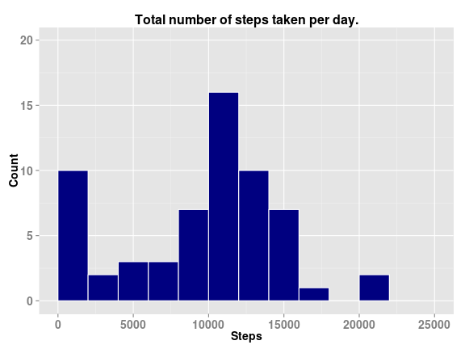
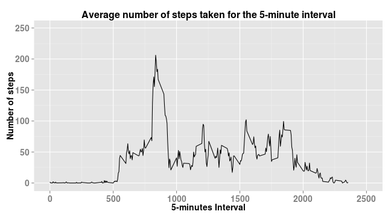
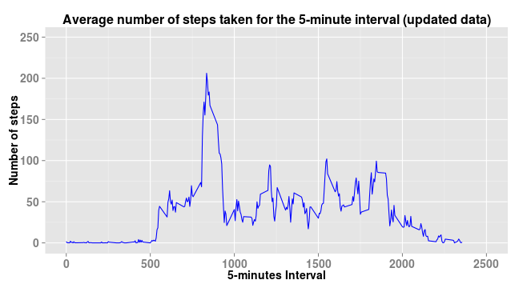
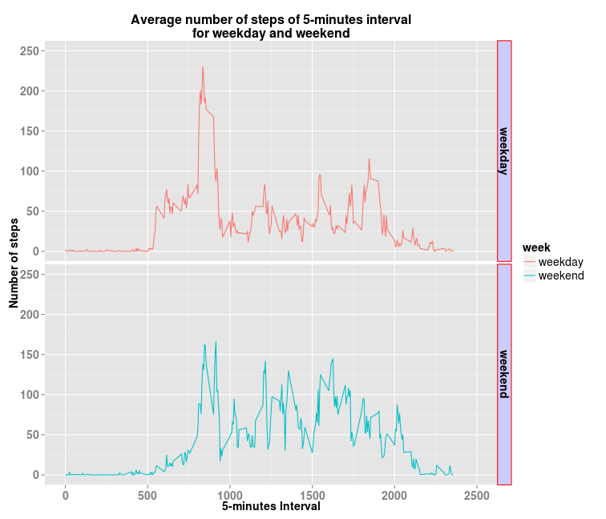

## Question 1. What is mean total number of steps taken per day?  

### Q1-1. histogram of the total number of steps taken each day  


```r
dat <- read.csv(file = "./activity.csv") # with stringsAsFactors = TRUE
sum.steps <- with(dat, tapply(steps, list(date), function(x) sum(x, na.rm = TRUE) ))
```
Here goes the histogram.  

```r
library(ggplot2)
sum.steps.df <- data.frame(ymd = names(sum.steps), steps = sum.steps)
rownames(sum.steps.df) <- 1:nrow(sum.steps)
g <- ggplot(data = sum.steps.df, aes(x = steps))
g <- g + geom_histogram(color = "white", fill = "navyblue", binwidth = 2000)
g <- g + ggtitle("Total number of steps taken per day.")
g <- g + scale_x_continuous(name = "Steps",
                            limits = c(0, 25000), 
                            breaks = seq(0, 25000, 5000))
g <- g + scale_y_continuous(name = "Count",
                            limits = c(0, 20), 
                            breaks = seq(0, 20, 5))
g <- g + theme(plot.title = element_text(size = 16, face = "bold"))
g <- g + theme(axis.title.x = element_text(size = 14, face = "bold"),
	           axis.text.x = element_text(size = 14, face = "bold"))
g <- g + theme(axis.title.y = element_text(size = 14, face = "bold"),
	           axis.text.y = element_text(size = 14, face = "bold"))
print(g)
```

 

### Q1-2. Mean and median total number of steps taken per day

And mean and median, respectively.  

```r
mean(sum.steps.df$steps)
```

```
## [1] 9354
```

```r
median(sum.steps.df$steps)
```

```
## [1] 10395
```
## Question 2: What is the average daily activity pattern?

### Q2-1. Make a time series plot (i.e. type = "l") of the 5-minute interval (x-axis) and the average number of steps taken, averaged across all days (y-axis)  

First, calculate number of steps grouped by "interval", and then draw plot.  


```r
ave.steps.by.intv <- aggregate(steps ~ interval, data = dat, function(x) mean(x, na.rm = TRUE))
g <- ggplot(data = ave.steps.by.intv, aes(x = interval, y = steps))
g <- g + geom_line()
g <- g + ggtitle("Average number of steps taken for the 5-minute interval")
g <- g + scale_x_continuous(name = "5-minutes Interval",
                            limits = c(0, 2500), 
                            breaks = seq(0, 2500, 500))
g <- g + scale_y_continuous(name = "Number of steps",
                            limits = c(0, 250), 
                            breaks = seq(0, 250, 50))
g <- g + theme(plot.title = element_text(size = 16, face = "bold"))
g <- g + theme(axis.title.x = element_text(size = 14, face = "bold"),
	           axis.text.x = element_text(size = 14, face = "bold"))
g <- g + theme(axis.title.y = element_text(size = 14, face = "bold"),
	           axis.text.y = element_text(size = 14, face = "bold"))
print (g)
```

 

### Q2-2. Which 5-minute interval, on average across all the days in the dataset, contains the maximum number of steps?  

Look for the 5-min interval with the max num of steps.  

```r
ave.steps.by.intv[ave.steps.by.intv$steps ==  max(ave.steps.by.intv$steps), ]
```

```
##     interval steps
## 104      835 206.2
```
Here is in detail.  

```r
paste("the 5-minutes interval containing the max value is: ",
      ave.steps.by.intv[ave.steps.by.intv$steps ==  max(ave.steps.by.intv$steps), ][[1]])
```

```
## [1] "the 5-minutes interval containing the max value is:  835"
```

```r
paste("the max number of steps: ",
      ave.steps.by.intv[ave.steps.by.intv$steps ==  max(ave.steps.by.intv$steps), ][[2]])
```

```
## [1] "the max number of steps:  206.169811320755"
```

```r
paste("and that's the ",
      rownames(ave.steps.by.intv[ave.steps.by.intv$steps ==  max(ave.steps.by.intv$steps), ]),
      "th value of 5-minutes interval.", sep = "")
```

```
## [1] "and that's the 104th value of 5-minutes interval."
```

## Question 3 Imputing missing values  

### Q3.1 Calculate and report the total number of missing values in the dataset (i.e. the total number of rows with NAs)  

Some analyses about missing values.  

```r
paste("total number of missing values in data:", sum(is.na(dat)))
```

```
## [1] "total number of missing values in data: 2304"
```

```r
paste("number of missing values in steps:", sum(is.na(dat$steps)))
```

```
## [1] "number of missing values in steps: 2304"
```

```r
paste("number of missing values in interva:", sum(is.na(dat$interval)))
```

```
## [1] "number of missing values in interva: 0"
```

```r
paste("number of missing values in date:", sum(is.na(dat$date)))
```

```
## [1] "number of missing values in date: 0"
```
As a result, you have now known all missing data (NA) lie in the column: steps.  

### Q3-2. Devise a strategy for filling in all of the missing values in the dataset. The strategy does not need to be sophisticated. For example, you could use the mean/median for that day, or the mean for that 5-minute interval, etc.  

Calculate number of NAs in date, and those in interval.

How many NAs does each day have?  

```r
dat.d <- dat[is.na(dat$steps), ]$date
dat.i <- dat[is.na(dat$steps), ]$interval
table(droplevels(dat.d)) 
```

```
## 
## 2012-10-01 2012-10-08 2012-11-01 2012-11-04 2012-11-09 2012-11-10 
##        288        288        288        288        288        288 
## 2012-11-14 2012-11-30 
##        288        288
```
And how many NAs does each interval have?  

```r
tb <- table(dat.i)
print(tb)
```

```
## dat.i
##    0    5   10   15   20   25   30   35   40   45   50   55  100  105  110 
##    8    8    8    8    8    8    8    8    8    8    8    8    8    8    8 
##  115  120  125  130  135  140  145  150  155  200  205  210  215  220  225 
##    8    8    8    8    8    8    8    8    8    8    8    8    8    8    8 
##  230  235  240  245  250  255  300  305  310  315  320  325  330  335  340 
##    8    8    8    8    8    8    8    8    8    8    8    8    8    8    8 
##  345  350  355  400  405  410  415  420  425  430  435  440  445  450  455 
##    8    8    8    8    8    8    8    8    8    8    8    8    8    8    8 
##  500  505  510  515  520  525  530  535  540  545  550  555  600  605  610 
##    8    8    8    8    8    8    8    8    8    8    8    8    8    8    8 
##  615  620  625  630  635  640  645  650  655  700  705  710  715  720  725 
##    8    8    8    8    8    8    8    8    8    8    8    8    8    8    8 
##  730  735  740  745  750  755  800  805  810  815  820  825  830  835  840 
##    8    8    8    8    8    8    8    8    8    8    8    8    8    8    8 
##  845  850  855  900  905  910  915  920  925  930  935  940  945  950  955 
##    8    8    8    8    8    8    8    8    8    8    8    8    8    8    8 
## 1000 1005 1010 1015 1020 1025 1030 1035 1040 1045 1050 1055 1100 1105 1110 
##    8    8    8    8    8    8    8    8    8    8    8    8    8    8    8 
## 1115 1120 1125 1130 1135 1140 1145 1150 1155 1200 1205 1210 1215 1220 1225 
##    8    8    8    8    8    8    8    8    8    8    8    8    8    8    8 
## 1230 1235 1240 1245 1250 1255 1300 1305 1310 1315 1320 1325 1330 1335 1340 
##    8    8    8    8    8    8    8    8    8    8    8    8    8    8    8 
## 1345 1350 1355 1400 1405 1410 1415 1420 1425 1430 1435 1440 1445 1450 1455 
##    8    8    8    8    8    8    8    8    8    8    8    8    8    8    8 
## 1500 1505 1510 1515 1520 1525 1530 1535 1540 1545 1550 1555 1600 1605 1610 
##    8    8    8    8    8    8    8    8    8    8    8    8    8    8    8 
## 1615 1620 1625 1630 1635 1640 1645 1650 1655 1700 1705 1710 1715 1720 1725 
##    8    8    8    8    8    8    8    8    8    8    8    8    8    8    8 
## 1730 1735 1740 1745 1750 1755 1800 1805 1810 1815 1820 1825 1830 1835 1840 
##    8    8    8    8    8    8    8    8    8    8    8    8    8    8    8 
## 1845 1850 1855 1900 1905 1910 1915 1920 1925 1930 1935 1940 1945 1950 1955 
##    8    8    8    8    8    8    8    8    8    8    8    8    8    8    8 
## 2000 2005 2010 2015 2020 2025 2030 2035 2040 2045 2050 2055 2100 2105 2110 
##    8    8    8    8    8    8    8    8    8    8    8    8    8    8    8 
## 2115 2120 2125 2130 2135 2140 2145 2150 2155 2200 2205 2210 2215 2220 2225 
##    8    8    8    8    8    8    8    8    8    8    8    8    8    8    8 
## 2230 2235 2240 2245 2250 2255 2300 2305 2310 2315 2320 2325 2330 2335 2340 
##    8    8    8    8    8    8    8    8    8    8    8    8    8    8    8 
## 2345 2350 2355 
##    8    8    8
```

```r
# just to make sure that every interval has unique number of missing value: 8
sum(tb != tb[[1]]) 
```

```
## [1] 0
```
Based on those analyses, we now know there are 8 days with NA's values, and each of which has the same total number of missing values: 288, and as to interval, each 288 interval has the same missing values: 8, respectively.  
It turns out NA values are evenly distributed across missing interval and date.  Now, my strategy is to prepate a data set of an average steps for interval, and fill NA with the value.  

### Q3-3. Create a new dataset that is equal to the original dataset but with the missing data filled in.  

My strategy is **to prepare a data set of the average steps at the each point of interval, which is calculated only from available values except NA in the original data set**, and fill missing values with it.


```r
ave.steps.by.intv <- aggregate(steps ~ interval, data = dat,
                               function(x) mean(x, na.rm = TRUE))

# rename data frame so it makes easier to understand operations onwards.
target.df <- dat
new.val.df <- ave.steps.by.intv

lv <- levels(droplevels(dat.d))

# fill with an averege steps for NA's interval for each NA's date.
for (ymd in lv) { # NA's date: "2012-10-01", "2012-10-08"..
    tmp.df <- target.df[target.df$date == ymd, ]
    for (i in new.val.df$interval) { # 0, 5, 10, ... 2355
        new.v <- new.val.df[ new.val.df$interval == i, ]$steps
        target.df[target.df$date == ymd & target.df$interval == i, ]$steps <- new.v
    }
}
```
Now you've got an updated data.frame: **target.df.**


### Q3-4. Make a histogram of the total number of steps taken each day and Calculate and report the mean and median total number of steps taken per day.Do these values differ from the estimates from the first part of the assignment? What is the impact of imputing missing data on the estimates of the total daily number of steps?  

Here goes the histogram with the updated data.frame.  

```r
# calculate average steps for each interval using the updated data.frame.
ave.steps.by.intv.adj <- aggregate(steps ~ interval, data = target.df,
                                   function(x) mean(x, na.rm = TRUE))
g <- ggplot(data = ave.steps.by.intv.adj, aes(x = interval, y = steps))
g <- g + geom_line(color = "blue")
g <- g + ggtitle("Average number of steps taken for the 5-minute interval (updated data)")
g <- g + scale_x_continuous(name = "5-minutes Interval",
                            limits = c(0, 2500), 
                            breaks = seq(0, 2500, 500))
g <- g + scale_y_continuous(name = "Number of steps",
                            limits = c(0, 250), 
                            breaks = seq(0, 250, 50))
g <- g + theme(plot.title = element_text(size = 16, face = "bold"))
g <- g + theme(axis.title.x = element_text(size = 14, face = "bold"),
	           axis.text.x = element_text(size = 14, face = "bold"))
g <- g + theme(axis.title.y = element_text(size = 14, face = "bold"),
	           axis.text.y = element_text(size = 14, face = "bold"))
print (g)
```

 

Here are the mean and median for **the updated data** set.  

```r
mean(ave.steps.by.intv.adj$steps)
```

```
## [1] 37.38
```

```r
median(ave.steps.by.intv.adj$steps)
```

```
## [1] 34.11
```

And those for **the original data** set.  

```r
mean(ave.steps.by.intv$steps)
```

```
## [1] 37.38
```

```r
median(ave.steps.by.intv$steps)
```

```
## [1] 34.11
```

With my approach to fill missing values with the average steps at the each point of interval, which is calculated only from available values except NA in the original data set, it turnes out the statistical values of mean, and median from the updated data set does not differ from those from the original.  
I'd say, with this way of imputing missing values, there would be no impact on the estimate of total number of steps.  


## Question 4: Are there differences in activity patterns between weekdays and weekends?  

### Q4-1. Create a new factor variable in the dataset with two levels: weekday and weekend - indicating whether a given date is a weekday or weekend day.  

Using POSIXlt and its wday attribute, you will be able to know weekday, and weekend.  

```r
# create POSIXlt data
target.df$date.p <- as.POSIXlt(as.Date(as.character(target.df$date)))
# 0 is Sunday, 6 is Saturday
target.df$is.weekend <- target.df$date.p$wday == 0 | target.df$date.p$wday == 6

# split data by is.weekend (TRUE/FALSE)
sp.wd <- split(target.df, target.df$is.weekend)

ave.steps.by.intv.wd <- aggregate(steps ~ interval, data = sp.wd[[1]],
                                  function(x) mean(x, na.rm = TRUE))
ave.steps.by.intv.we <- aggregate(steps ~ interval, data = sp.wd[[2]],
function(x) mean(x, na.rm = TRUE))

# now create data.frame for each of weekday, and weekend, then union them by rbind.
wd <- data.frame(week = rep("weekday", nrow(ave.steps.by.intv.wd)), ave.steps.by.intv.wd)
we <- data.frame(week = rep("weekend", nrow(ave.steps.by.intv.we)), ave.steps.by.intv.we)

ave.steps.by.intv.g <- rbind(wd, we)

str(ave.steps.by.intv.g)
```

```
## 'data.frame':	576 obs. of  3 variables:
##  $ week    : Factor w/ 2 levels "weekday","weekend": 1 1 1 1 1 1 1 1 1 1 ...
##  $ interval: int  0 5 10 15 20 25 30 35 40 45 ...
##  $ steps   : num  2.251 0.445 0.173 0.198 0.099 ...
```

The column **week** in ave.steps.by.intv.g data.frame is a new factor variable with two levels of weekday and weekend.  


### Q4-2. Make a panel plot containing a time series plot (i.e. type = "l") of the 5-minute interval (x-axis) and the average number of steps taken, averaged across all weekday days or weekend days (y-axis).   

Here goes a panel plot!  


```r
g <- ggplot(data = ave.steps.by.intv.g,
            aes(x = interval, y = steps, group = week, color = week))
g <- g + geom_line()
g <- g + facet_grid(week ~ .)
g <- g + ggtitle("Average number of steps of 5-minutes interval\nfor weekday and weekend")
g <- g + scale_x_continuous(name = "5-minutes Interval",
                            limits = c(0, 2500), 
                            breaks = seq(0, 2500, 500))
g <- g + scale_y_continuous(name = "Number of steps",
                            limits = c(0, 250), 
                            breaks = seq(0, 250, 50))
g <- g + theme(plot.title = element_text(size = 16, face = "bold"))
g <- g + theme(axis.title.x = element_text(size = 14, face = "bold"),
	           axis.text.x = element_text(size = 14, face = "bold"))
g <- g + theme(axis.title.y = element_text(size = 14, face = "bold"),
	           axis.text.y = element_text(size = 14, face = "bold"))
g <- g + theme(strip.text.y = element_text(size = 14, face = "bold"),
               strip.background = element_rect(colour="red", fill="#CCCCFF"))
g <- g + theme(legend.title = element_text(size = 14))
g <- g + theme(legend.text = element_text(size = 14))
print(g)
```

 

With some addtional investigation...

mean and median of steps for weekday.  

```r
mean(wd$steps)
```

```
## [1] 35.61
```

```r
median(wd$steps)
```

```
## [1] 25.8
```

And those for weekend.  

```r
mean(we$steps)
```

```
## [1] 42.37
```

```r
median(we$steps)
```

```
## [1] 32.34
```
